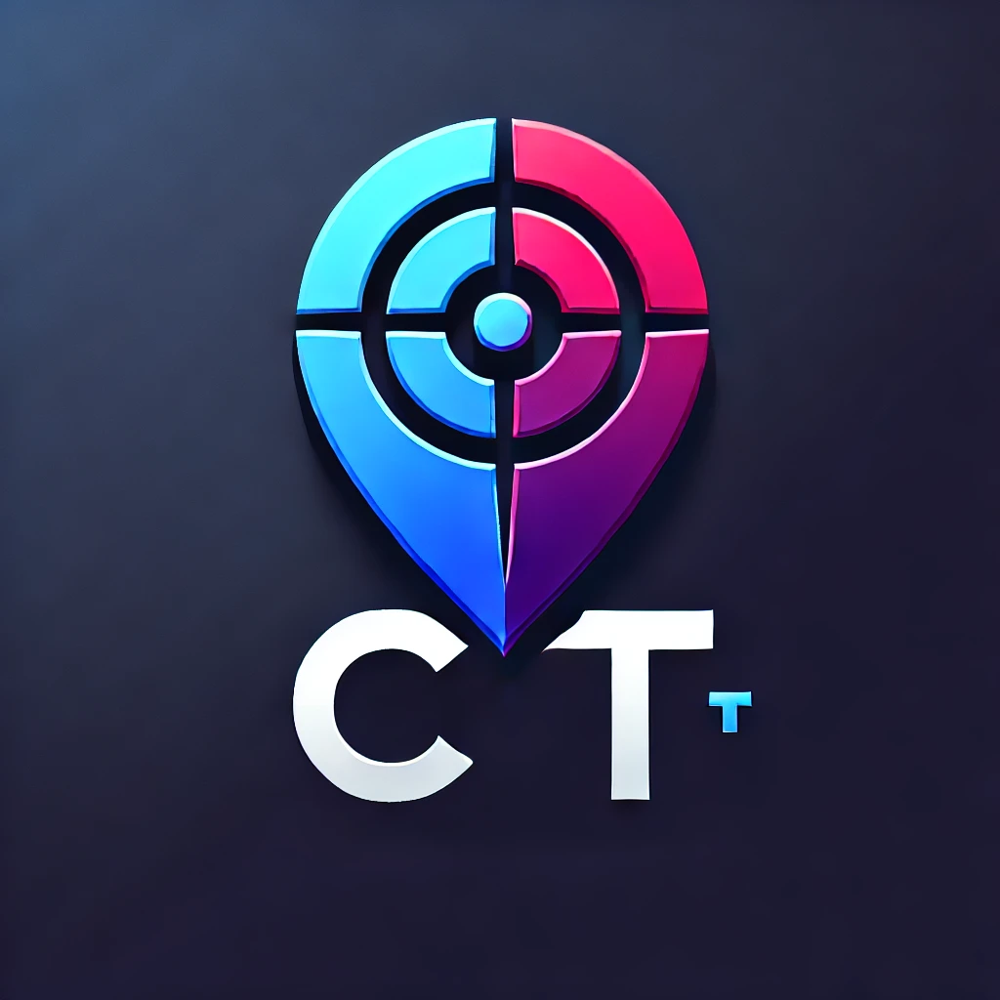
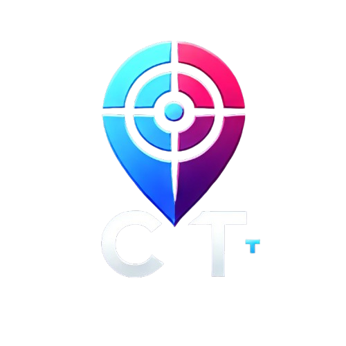

# Lost & Found NITH

[](https://nithlostandfoundweb.netlify.app)
[](https://flutter.dev/)
[](https://firebase.google.com/)

A comprehensive Lost & Found application for National Institute of Technology, Hamirpur (NITH) students and staff. This platform helps users report lost items and claim found items, making it easier to reunite people with their belongings.

## 🌐 Live Demo

Check out the live application: [https://nithlostandfoundweb.netlify.app](https://nithlostandfoundweb.netlify.app)

## 📚 Documentation

For detailed documentation, please see:
- [Main Documentation](docs/README.md)
- [API Keys Setup Guide](docs/API_KEYS.md)
- [Installation Guide](docs/INSTALLATION.md)

## 📱 Features

### Core Functionality
- **AI-Powered Post Creation**: Automatically extract item details from user descriptions using AI
- **Lost/Found Item Reporting**: Simple interface to report lost or found items
- **Smart Categorization**: Automatic categorization of items with predefined lists
- **Location-Based Filtering**: Search items based on specific locations within NITH campus
- **Image Upload**: Attach clear images of items to help with identification
- **Social Sharing**: Share posts directly with deep linking support
- **Verification System**: Secure claim process with verification questions for found items

### Advanced Features
- **Real-time Updates**: Instant notifications when someone interacts with your posts
- **User Profiles**: Personalized profiles with contact information
- **Admin Panel**: Moderation tools for managing reports and content
- **Responsive Design**: Works seamlessly on mobile, tablet, and desktop
- **Deep Linking**: Direct links to specific posts for easy sharing

## 🚀 Technologies Used

### Frontend
- **Flutter**: Cross-platform mobile and web application framework
- **Dart**: Programming language for Flutter development
- **Material Design**: UI components following Google's design guidelines

### Backend
- **Firebase Firestore**: NoSQL database for storing posts and user data
- **Firebase Authentication**: Secure user authentication system
- **Firebase Storage**: Cloud storage for images and media
- **Cloud Functions**: Serverless functions for backend logic

### AI Integration
- **Google Gemini AI**: Natural language processing for automatic post creation

### Deployment
- **Netlify**: Web hosting platform
- **GitHub**: Version control and CI/CD

## 📸 Screenshots

### Home Page

*Main dashboard showing lost and found items*

### AI-Powered Post Creation
*Smart form that automatically fills details using AI*

### Item Details

*Detailed view of lost/found items with images*

### User Profile

*Personal profile management*

## 🛠️ Installation

### Prerequisites
- Flutter SDK (3.0 or higher)
- Dart SDK
- Firebase account
- Android Studio / Xcode/ VsCode (for mobile development)


### Setup Instructions

1. **Clone the repository**
   ```bash
   git clone https://github.com/your-username/l_f.git
   cd l_f
   ```

2. **Install dependencies**
   ```bash
   flutter pub get
   ```

3. **Firebase Configuration**
   - Create a Firebase project at [Firebase Console](https://console.firebase.google.com/)
   - Add your Android/iOS app to the Firebase project
   - Download and replace the `google-services.json` (Android) and `GoogleService-Info.plist` (iOS) files
   - Enable Firestore, Authentication, and Storage in Firebase

4. **API Keys Setup**
   - Copy the API keys template file:
   ```bash
   cp lib/constants/api_keys_template.dart lib/constants/api_keys.dart
   ```
   - Edit `lib/constants/api_keys.dart` and replace the placeholders with your actual API keys:
   ```dart
   const String geminiApiKey = 'YOUR_ACTUAL_GEMINI_API_KEY';
   const String stabilityApikey = 'YOUR_ACTUAL_STABILITY_AI_API_KEY'; // Optional
   ```
   - **Important**: The `api_keys.dart` file is excluded from version control for security reasons

5. **Run the application**
   ```bash
   flutter run
   ```

## 🔐 Security Best Practices

### API Key Management
- **Never commit API keys** to version control systems
- Use environment variables or secure configuration files
- Regularly rotate API keys
- Monitor API usage for unusual activity
- Use separate API keys for development and production

### Data Protection
- All user data is encrypted in transit and at rest
- Firebase Security Rules protect unauthorized access
- User authentication is required for sensitive operations

## 📱 Usage

### Creating a Post with AI
1. Tap the floating action button (AI icon) on the home screen
2. Describe your lost/found item in natural language
3. Click "Extract Details with AI"
4. Review and edit the automatically filled details
5. Upload images of the item
6. Submit the post

### Searching for Items
1. Use the filter options to narrow down results
2. Search by item type, location, or date
3. Click on any item to view full details
4. Use the reply or claim buttons to contact the owner/founder

### Managing Your Posts
1. Navigate to "My Posts" section
2. View all your created posts
3. Edit or delete posts as needed
4. Track responses and claims

## 🔧 Configuration

### Deep Linking Setup
To enable deep linking:
1. Configure your domain in `pubspec.yaml`
2. Set up redirect URLs in Firebase Hosting
3. Test deep links with: `https://nithlostandfoundweb.netlify.app/post/{postId}`

### Customization
- Modify location lists in `lib/Frontend/Contants/lists.dart`
- Update item categories in the same file
- Customize UI colors in `lib/constants/colors.dart` (if exists)

## 🤝 Contributing

1. Fork the repository
2. Create a feature branch (`git checkout -b feature/AmazingFeature`)
3. Commit your changes (`git commit -m 'Add some AmazingFeature'`)
4. Push to the branch (`git push origin feature/AmazingFeature`)
5. Open a pull request

## 📄 License

This project is licensed under the MIT License - see the [LICENSE](LICENSE) file for details.

## 🙏 Acknowledgments

- Google Gemini AI for powering the smart post creation
- Flutter community for the amazing framework
- Firebase for reliable backend services


## 📞 Support

For support, email [abhishekgodara202226@example.com] or create an issue in the GitHub repository.

## 🔄 Updates

### Version 1.0.0
- Initial release with core functionality
- AI-powered post creation
- Firebase integration
- Social sharing with deep links

### Upcoming Features
- Image recognition for automatic item identification
- Push notifications
- Advanced search filters
- Multi-language support

---

**Made with ❤️ for NITH Community**
